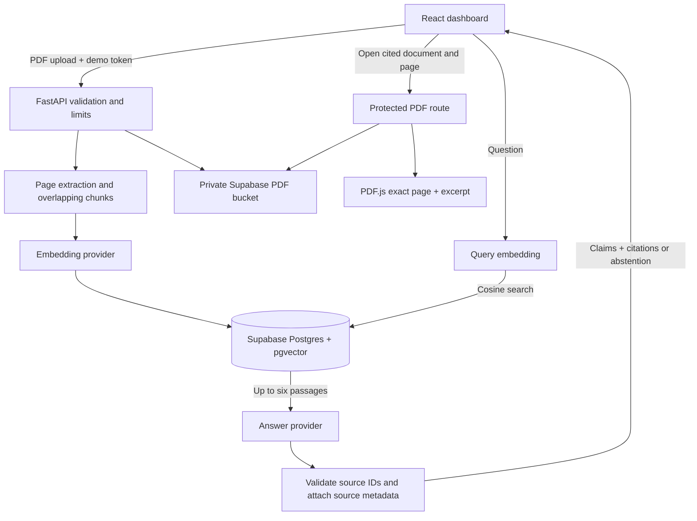

# Learn the project, one layer at a time

## 1. Settings and data shapes

`backend/app/config.py` reads environment variables once. It rejects wildcard CORS, missing live credentials, mismatched vector dimensions, and live write access without a long shared passphrase. `models.py` uses Pydantic to describe the data crossing each boundary. `__init__.py` files mark Python packages; they contain no business logic.

Data enters as a validated question or file and leaves as a document or answer record. Explicit shapes catch mistakes before they reach storage or the UI.

## 2. Upload and storage

`services/extraction.py` reads a PDF with pypdf, preserves physical page numbers, normalizes whitespace, and splits each page into passages of about 1,400 characters with 200-character overlap. These are character sizes, not token counts. Pages never merge, so a chunk always points to one page. Empty pages are skipped without renumbering later pages. Scans, locked files, huge text, and malformed PDFs receive clear errors. Mixed scanned/text PDFs index only their extractable text.

`services/research.py` orchestrates upload: create an extracting record, extract and chunk, mark embedding, call the embedding provider, save PDF and passages, then mark ready. Failed records remain visible and excluded from search. `repositories/base.py` describes storage operations. `repositories/local.py` uses SQLite and stores PDF bytes in the same local database. `repositories/supabase.py` uses HTTP to call PostgREST, the vector-search RPC, and private Storage. This layer is the only one that knows vendor URLs and table contracts.

`supabase/migrations/001_research.sql` creates the tables, foreign-key cascade, cosine search function, and private bucket. RLS is enabled; no anonymous or authenticated browser policies are granted. The service role alone can call the function and manipulate records. Exact pgvector cosine search is enough for the small demo; HNSW would be a measured scale upgrade.

## 3. Retrieval and answer generation

`providers/interfaces.py` contains two small protocols: embed texts and answer from chunks. `providers/openai_provider.py` batches embeddings and asks for structured claims with source IDs. It sends only the question and up to six retrieved passages to the answer model. No whole PDFs, conversation history, or unrelated passages are sent. Model input remains untrusted content.

The research service rejects the entire answer if any claim has missing or unknown source IDs. It copies titles, page numbers, and excerpts from retrieved records, never from model-generated metadata. An empty retrieval, explicit insufficiency, refusal, or invalid citation set produces the standard abstention. This guarantees source existence, **not semantic entailment**; a model could still misuse a real passage. Human inspection and evaluation remain necessary.

`providers/local.py` deliberately replaces semantic embeddings with hashed word vectors and generated prose with excerpts. It tests wiring without secrets, costs, or a network. Its scores do not predict live model quality.

## 4. API and safeguards

`main.py` assembles the application and its dependencies. Uploads run in a worker thread so document polling can continue. One mutation and two questions can run at once. `security.py` counts incoming body bytes, checks a shared bearer passphrase, and applies sliding-window request limits. There is no user-supplied Storage path: UUIDs identify files.

The PDF route streams a private object into an authenticated response with `no-store`. A deletion marks a document deleting, removes the object, then deletes its database row (cascading chunks). If deletion fails, retrying is safe and the document stays out of retrieval. Active answers can briefly contain stale citations if deletion races with a question; opening the missing PDF returns a clear 404. The deleting client clears its old answers.

One worker is intentional: locks, rate limits, and interrupted-upload recovery are process-local. On restart, extracting/embedding rows become errors. This is not a durable job queue. A production version should use authenticated ownership, distributed quotas, a job worker, retries, parser isolation, malware scanning, and storage/database reconciliation.

## 5. Browser experience

`frontend/index.html` hosts the React root. `src/main.jsx` mounts React and maps routes. `vite.config.js` configures the development server and React compiler. `package.json` describes commands and packages; `package-lock.json` fixes the installed dependency tree.

`pages/Landing.jsx` observes the seven process sections. `components/Spine.jsx` draws a simplified human spine with SVG and illuminates vertebral groups as the active section changes. No per-frame React scroll handler runs. All text remains in the document. `styles.css` adapts the layout and removes transitions/opacity suppression for reduced-motion visitors. Fonts have local system fallbacks if the external font service is unavailable.

`pages/Dashboard.jsx` holds library, upload, conversation, and selected-citation state. It polls during processing and shows errors next to the workspace. `api.js` handles URLs, timeouts, response parsing, and the in-memory demo token. There are no model or Supabase credentials in React.

`components/CitationViewer.jsx` opens an accessible native dialog. PDF.js fetches the protected PDF and renders the physical page to canvas. The plain-text excerpt supplies a readable alternative. Escape closes the dialog and native dialog behavior contains keyboard focus. PDF.js is loaded only when needed. `Brand.jsx` supplies the shared home link and mark.

## 6. Samples, evaluation, and deployment

`sample_documents/corpus.json` is the editable source corpus. `generate.py` draws one source entry per PDF page, producing three tiny CC0 fixtures. The sample README explains permission and substitution.

`backend/tests/test_research.py` tests behavior across the API and local storage. Provider/repository contract tests exercise HTTP expectations without external accounts. `evaluation/questions.json` pairs questions with facts and page references. `evaluation/run.py` uses a temporary local library or a supplied live API and produces JSON metrics plus individual answers for review.

`render.yaml` describes two services: a static frontend with a routing rewrite, and a single-worker backend bound to Render's port. `docs/SETUP.md`, `DEPLOYMENT.md`, and `EVALUATION.md` explain operation. `.env.example` files show configuration without secrets; `.gitignore` excludes actual secrets, local data, caches, and generated build files.

## Request flow

